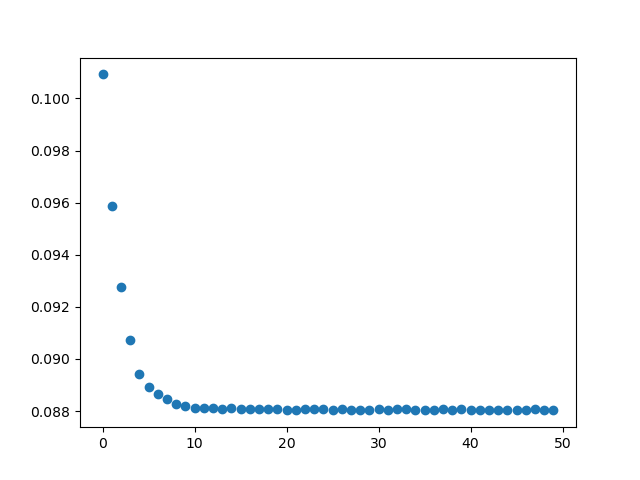
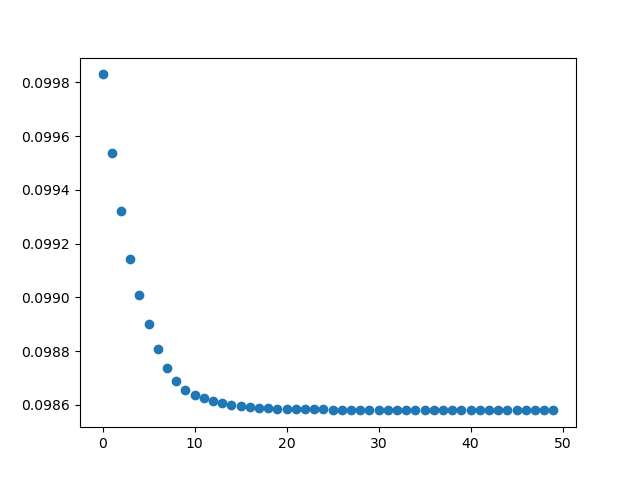
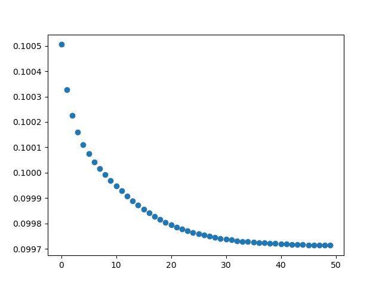
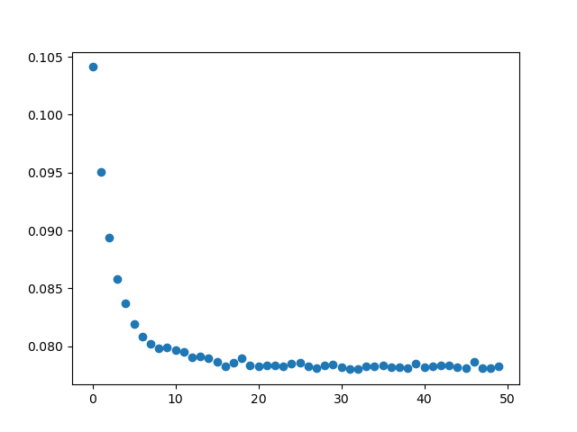
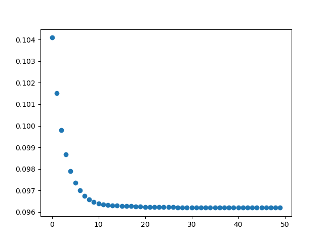
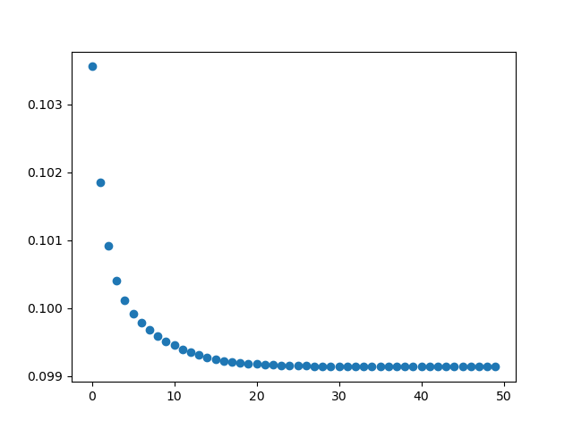
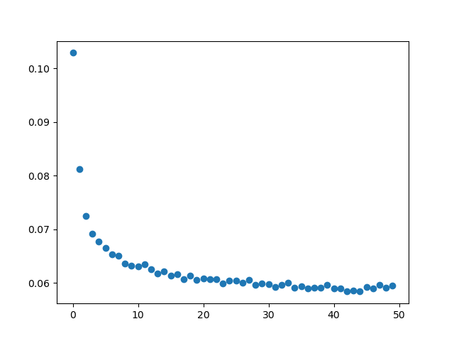
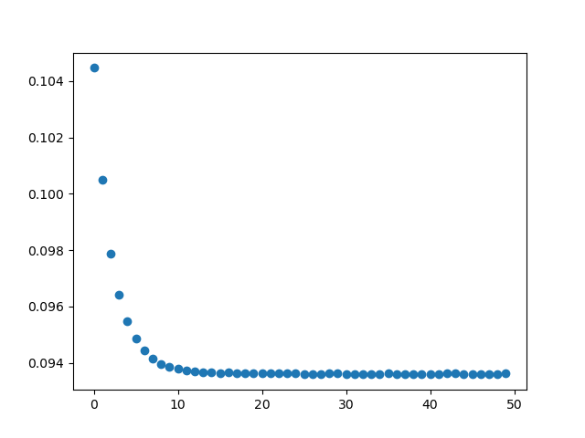
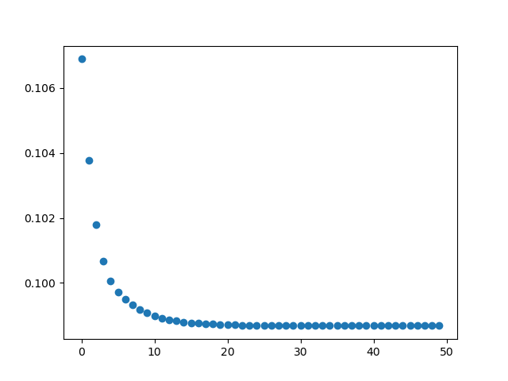

# Task 3

To implement task 3, we created 9 unique datasets covering all 9 permutations of the number of dimensions and number of samples. With this, we can test the performance impact of using varying numbers of each and observe any differences in the convergence pattern and time taken to run. 

For this problem, we use a learning rate $\eta$ of 0.001 and 50 iterations. C is set to 0.1. 

```
# 

from LinearSVC import LinearSVC as mySVC
from sklearn.svm import LinearSVC as skSVC
import time
import numpy as np
import pandas as pd
import csv

from matplotlib import pyplot as plt 

"""
Investigate the scalability of the LinearSVC class you have implemented. Using the dataset
generator developed in the previous task, you may produce random datasets regarding to the 9 combinations
of the following scales: d = 10, 50, 100 and n = 500, 5000, 50000. You may assign a large constant such
as 100 to u. (Please feel free to slightly adjust the scales according to your computer’s hardware.) Evaluate
the time cost and loss convergence of your linear SVC on the 9 datasets. The comparison should be given
by tables along with explanations.
"""

from datagen import DataGenerator
import itertools

n_dims = [10, 50, 100]
n_samples = [500, 5000, 50000]

dg1 = DataGenerator(100)

sets = []
errors = []

my_svc = mySVC(0.001, 50, 1)

def plot_losses(loss_values : list):
    x_vals = np.linspace(0, 49, 50)
    plot = plt.plot()
    plt.scatter(x = x_vals, y = loss_values)
    plt.show()

for dims, samples in itertools.product(n_dims, n_samples):
    print(dims, samples)
    data = dg1.generate(samples, dims, 0, u_range = 10)
    train_name = str(dims) + "d_" + str(samples) + "n_train.csv"
    test_name = str(dims) + "d_" + str(samples) + "n_test.csv"
    with open("data/" + train_name, mode = "w", newline = '') as f:
        writer = csv.writer(f)
        writer.writerows(data[0])
    with open("data/" + test_name, mode = "w", newline = '') as f:
        writer = csv.writer(f)
        writer.writerows(data[1])

    X_data = (data[0])[:, 0:dims - 1]
    y_data = (data[0])[:, dims - 1]
    fit_start = time.clock_gettime(5)
    my_svc.fit(X_data, y_data, 0.1)
    fit_end = time.clock_gettime(5)
    print("%d dims, %d samples: %f" % (dims, samples, fit_end - fit_start))
    end_weight = my_svc.w_
    errors.append(my_svc.losses_)


for l in errors:
    plot_losses(l)

```

### Loss Plots
The plots start at 10 dimensions and 500 samples, increasing by sample size until reaching the next dimension. Error rate is plotted on the y-axis against the epoch number on the x-axis. 

**d = 10, n = 500**


**d = 10, n = 5000**



**d = 10, n = 50000**


**d = 50, n = 500**


**d = 50, n = 5000**


**d = 50, n = 50000**


**d = 100, n = 500**


**d = 100, n = 5000**


**d = 100, n = 50000**



A couple of patterns can be extrapolated from these plots. For one, it takes models with more features a longer period of time to converge. The slope of the convergence curve, particularly for $n = 50,000$, is either just as steep (in the $d = 100$ case) or notably steeper (in the $d = 10$ case). This indicates that more epochs are required in order to accomodate and properly fit the rest of the data. 

Another pattern that can be witnessed is the smoothness of each convergence curve. When the ratio of dimensions to samples, $\frac{n}{d}$ is low, we can see a more jittery convergence pattern. This is most evidence in the case where $d = 100$ and $n = 500$. Given that the hinge loss is either 0 or 2 for each feature along with the greater complexity of a model with many features, there is a greater likelihood that an observation does not get properly classified and can shoot up the error rate on specific epochs. 

Regardless, it seems that performance of the model, when measured by the ability to converge, holds up well when dimensions and sample numbers get large. 

### Runtimes

The increase in the number of samples was a much higher driver of increased runtime than increasing the dimensionality. Increasing by a factor of 10 between 500, 5000, and 50000 resulted in a proportional increase in runtime by rougly an order of magnitude. This indicates pseudo-$O(n)$ levels of performance, likely $O(kn)$ for some constant k. The outer loop of `n_iter` is a smaller and smaller proportion of the runtime as $n$ gets larger. In contrast, the inner loop calculating each sample is strictly $O(n)$ as it must iterate over each sample-label pair. 

**NOTE**: Dimension here reads as one more than the actual (i.e. 11 instead of 10) due to how the training data has had labels appended as one extra column. The feature matrix and labels **are** separated in the code. 

```
my_svc


Model fit complete
11 dims, 350 samples: 0.136001
Model fit complete
11 dims, 3500 samples: 1.301007
Model fit complete
11 dims, 35000 samples: 12.836070
Model fit complete
51 dims, 350 samples: 0.138001
Model fit complete
51 dims, 3500 samples: 1.342007
Model fit complete
51 dims, 35000 samples: 13.323073
Model fit complete
101 dims, 350 samples: 0.143001
Model fit complete
101 dims, 3500 samples: 1.370008
Model fit complete
101 dims, 35000 samples: 13.697075
```

While converging performance holds up well, the runtime of this implementation may not scale the best compared to others, specifically those in `sklearn` that tend to always complete in under 1 second. Use of this implementation could cause issues with even larger datasets. 


## Task 4

We can now compare our model to those provided by `scikit-learn` to see how performance and convergence compare. We can compare plots used for task 3 against new data for this task. 

From the line plot, we can see that both the primal model and custom SVC implementation consistently converge very quickly, tending to require only the first few epochs. This is vastly different than the dual model, which takes significantly more epochs and in a more jagged pattern. When running the dual model, it also takes substantially more time (from the perception of a human through measurement in seconds) than the other two by orders of magnitude. There is something specific about the dual model in the way it solves the optimization problem that creates more discontinuity; this could be attributed to the added complexity that the Lagrange multipliers can have on the model update. 

Given that the primal model can converge quickly and with relatively low time, it seems to be a good candidate for scalability. It manages to achieve the same results as the other two models and, in some cases, at a fraction of the time. 

